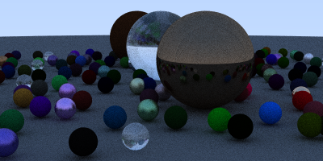
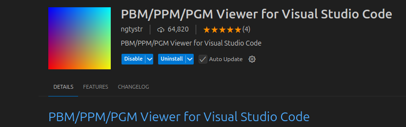

# RayTracer

## Description

Welcome to the Ray Tracing project! This project, built in C++, is a ray tracer designed to simulate realistic 3D scenes by modeling the behavior of light. It accommodates various objects, shapes, and material types, providing a flexible and customizable rendering environment. The ray tracer incorporates essential rendering techniques such as reflection, refraction, and shading, enabling the creation of visually realistic images. It supports the rendering of spheres, planes, and other geometric shapes, and implements surface materials like diffuse, reflective, and refractive for accurate light interactions. The project is capable of handling complex scenes with numerous objects and uses a ray tracing algorithm to calculate pixel colors based on light-object interactions. By leveraging vector mathematics and physics-based lighting models, it enhances realism. Additionally, texture and environment mapping are integrated for more detailed visuals, and multi-threading is employed to optimize rendering performance. This project serves as a foundational tool for learning and exploring advanced rendering techniques in computer graphics, and contributions and optimizations are encouraged!

## Getting Started

### Dependencies

* Before developing or running this ray tracing project, ensure that you have the necessary *theoretical knowledge, programming skills, and software setup*.  

### 1. Theoretical Knowledge  
To understand and develop the core components of this ray tracer, you should be familiar with:  
- Vector Operations like Dot product, cross product, and vector transformations.  
- Ray Optics concepts like reflection, refraction, Snell’s Law, and light interactions.  
- Mathematical Foundations of  Linear algebra and geometry for ray tracing calculations.  

### 2. Programming Knowledge  
- *C++ Basics*: Strong understanding of syntax, memory management, and STL.  
- *Object-Oriented Programming (OOPs)*: Knowledge of classes, inheritance, polymorphism, and encapsulation.  

### 3. Software Requirements  
Ensure that the following software is installed for development:  
- *VS Code* (Recommended IDE) – [Download Here](https://code.visualstudio.com/)  
- *C++ Compiler*:  
  - Windows: MinGW / MSVC (Microsoft Visual C++)  
  - Linux: GCC / G++/ Clang
- *PPM Extension* - Required for creating the PPM image after rendoring the program.

  -

### Executing program

Follow these steps to compile and run the program:  

### 1. Compiling the Code  
- Click on the *Run* button (usually located at the top right corner in VS Code) to compile the code automatically.  

## Help

- **Make Sure All Required Libraries Are Included**  
  - Before compiling, confirm that all the necessary libraries and header files are properly included in your main code to prevent missing dependencies.  

- **Store All Files in a Single Directory**  
  - For smooth execution, keep all project files (source code, headers, assets) in the same directory.  
  - This will help avoid path-related errors when running the program.  

If you run into any issues, check these points first before diving into further troubleshooting. 🚀

## Authors

Smarak Patnaik 

### Book Reference  
The concepts and techniques used in this project are inspired from the book:  
- *Ray Tracing in One Weekend* by *Peter Shirley*  

If you'd like to contribute, feel free to submit a pull request or report issues. 🚀

## Acknowledgments

I would like to express my sincere gratitude to the following individuals and resources:  

- Peter Shirley, author of the book Ray Tracing in One Weekend, whose work greatly influenced the techniques and algorithms implemented in this project.  
- Our mentors and peers for their valuable insights and feedback throughout the development process.  
- The open-source community for providing tools, libraries, and frameworks that made this project possible, including CMake, GLFW, and Eigen.  
Without these resources, this project would not have been possible. 
